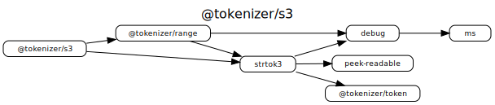

[](https://travis-ci.org/Borewit/tokenizer-s3)
[](https://npmjs.org/package/@tokenizer/s3)
[](https://npmcharts.com/compare/@tokenizer/s3,@tokenizer/range,streaming-http-token-reader?start=300)
[](https://snyk.io/test/github/Borewit/tokenizer-s3?targetFile=package.json)
[](https://lgtm.com/projects/g/Borewit/tokenizer-s3/alerts/)
[](https://lgtm.com/projects/g/Borewit/tokenizer-s3/context:javascript)

# @tokenizer/s3
Specialized [_tokenizer_](https://github.com/Borewit/strtok3#tokenizer) to access files stored on the  [Amazon Web Services (AWS) S3 cloud storage](https://docs.aws.amazon.com/AmazonS3/latest/dev/Welcome.html).

## Installation
```shell script
npm install @tokenizer/s3
```

## Reading audio metadata from Amazon S3 

Retrieve music-metadata 
```js
const s3tokenizer = require("@tokenizer/s3");
const mm = require("music-metadata/lib/core");
/**
 * Retrieve metadata from Amazon S3 object
 * @param objRequest S3 object request
 * @param options music-metadata options
 * @return Metadata
 */
async function parseS3Object(s3, objRequest, options) {
    const s3Tokenizer = await  s3tokenizer.makeTokenizer(s3, objRequest, options);
    return mm.parseFromTokenizer(s3Tokenizer, options);
}

(async () => {
  const s3 = new S3();
  
  const metadata = await mmS3client.parseS3Object({
        Bucket: 'music-metadata',
        Key: 'Various Artists - 2008 - netBloc Vol 13 (color in a world of monochrome) {BSCOMP0013} [MP3-V0]/01 - Nils Hoffmann - Sweet Man Like Me.mp3'
      }
    );
})();
```
An module implementation of this example can be found in [@music-metadata/s3](https://github.com/Borewit/music-metadata-s3).

## Dependency graph


